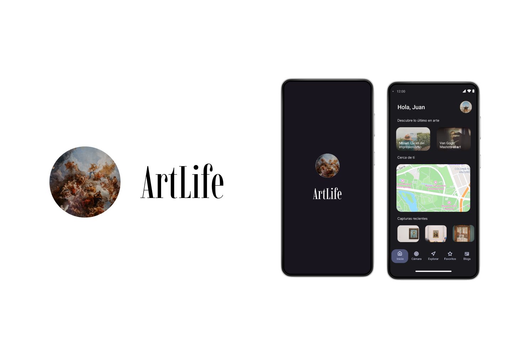

# ArtLife

## Description

ArtLife is an Android app that uses computer vision (soon to be implemented) to recognize famous paintings. Explore the world of art and learn more about them through blogs. Discover art galleries and museums near your location.

## Features

- [x] Explore famous paintings
- [x] Learn more about them through blogs
- [x] Discover art galleries and museums near your location
- [x] Share your favorite paintings with your friends
- [ ] Computer vision to recognize paintings

